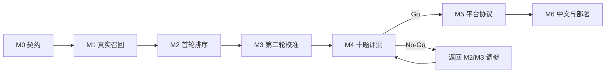

# Research Retrieval Calibrator 执行路线图

## 1. 计划规则

本文件只定义阶段边界与依赖。详细任务和验收步骤在 `docs/phases/`。阶段必须串行解锁；同一阶段内，只有阶段文件明确标为可并行的任务才能并行。

讨论稿原编号与本仓库编号的对应关系如下：

| 讨论稿能力 | 本仓库阶段 | 调整原因 |
|---|---|---|
| 范围与评测冻结 | M0 | 保持最先 |
| arXiv 检索闭环 | M1 | 先建立真实候选来源 |
| 向量化与首轮重排 | M2 | 在真实候选上验证 |
| 反馈与第二轮校准 | M3 | 尽早验证产品核心风险 |
| 离线评测主体 | M4 | 在平台包装前作 Go/No-Go |
| OpenAI 兼容服务骨架 | M5 | 核心有效后再接平台 |
| CNKI、部署与比赛演示 | M6 | 最后建设合规中文支线和交付包装 |

## 2. 里程碑

### M0：产品与评测契约

输出领域枚举、Pydantic/JSON Schema 契约、状态机、10 题评测模板、指标定义和预注册 Go/No-Go 门禁。

完成标准：`M0-T01` 至 `M0-T04` 全部通过，契约验证证据可机器读取。

### M1：首轮真实召回

实现 Research Intent IR、四路线查询规划、arXiv 适配器、缓存/限速/重试、论文标准化和去重，并通过 CLI 输出真实候选。

完成标准：真实来源 ID 覆盖率 100%，元数据幻觉率 0，录制回放和真实网络证据分离。

### M2：首轮排序与选择

实现 embedding、reranker、分项评分、证据槽位分类、多样性选择和 15-20 篇首轮报告。

完成标准：冻结输入上排序可复现，所有入选论文有分项解释，测试覆盖重复惩罚和槽位补齐。

### M3：反馈与第二轮校准

实现反馈解析、维度化部分相关、Rocchio baseline、术语升降权、路线预算更新、第二轮重检索、结果合并和变化报告。

完成标准：一个真实问题的首轮、6 条人工反馈、第二轮和前后指标表齐全；第二轮主指标改善且证据覆盖不下降。

### M4：十题离线评测

冻结 10 个真实问题、人工判断和四组基线，运行完整评测并形成 Go/No-Go 报告。

完成标准：满足 `PRODUCT_SPEC.md` 第 2 节全部 Go 条件；否则状态改为 `NO_GO` 并返回 M2 或 M3。

### M5：OpenAI 兼容服务

将已验证核心封装为 `/v1/models` 与 `/v1/chat/completions`，实现鉴权、流式/非流式响应、服务端项目状态和平台探测。

完成标准：协议契约测试、并发状态测试、安全日志测试和真实平台探测通过。

### M6：CNKI、部署与比赛演示

实现合规中文检索式与题录导入、中英文统一排序、容器化部署、HTTPS、监控、回滚和比赛演示包。

完成标准：所有导入格式、双语案例、部署恢复、失败案例和最终演示脚本通过。

## 3. 阶段依赖

## 4. 版本节点

- 基线文档：`v0.1.0-plan`
- M0 完成：`v0.2.0-contracts`
- M1 完成：`v0.3.0-retrieval`
- M2 完成：`v0.4.0-round1`
- M3 完成：`v0.5.0-calibration`
- M4 Go：`v0.6.0-evaluated`
- M5 完成：`v0.7.0-api`
- M6 完成：`v1.0.0-competition`

标签只在阶段 PR 合并且 `STATUS.md` 标记 `COMPLETE` 后创建。

## 5. 返工规则

- M1 真实性失败：不得通过增加模型提示词掩盖，必须修数据源或标准化。
- M2 排序失败：保留原始召回快照，修改模型/特征/选择策略并建立新配置版本。
- M3 第二轮退化：优先检查部分相关维度、负反馈权重、术语漂移和路线预算。
- M4 No-Go：不进入 M5；报告失败问题和回退任务 ID。
- M5 平台失败：不得改动已冻结的 M4 排序结果来换取协议通过。
- M6 中文支线失败：允许保留英文主链，但不得宣传自动搜索知网。
